# HRMS – İnsan Kaynakları Yönetim Sistemi

## Proje Hakkında

Bu proje **Laravel Framework** kullanılarak geliştirilmiş bir **İnsan Kaynakları Yönetim Sistemi (HRMS)** uygulamasıdır.

Sistem üzerinden çalışan yönetimi, departmanlar, şubeler, vardiyalar ve çeşitli insan kaynakları işlemleri yönetilebilir.

Proje eğitim ve portföy amaçlı geliştirilmiştir.

---

# Kullanılan Teknolojiler

* Laravel
* PHP
* MySQL
* Bootstrap
* jQuery
* Select2
* XAMPP

---

# Sistem Özellikleri

* Admin giriş sistemi
* Çalışan ekleme / düzenleme / silme
* Departman yönetimi
* Şube yönetimi
* İş kategorileri yönetimi
* Eğitim bilgileri yönetimi
* Vardiya yönetimi
* Çalışan maaş bilgileri
* Sigorta bilgileri
* Çalışan adres ve iletişim bilgileri
* Demo veri sistemi (Seeder)

---

# Admin Giriş Bilgileri

Migration çalıştırıldığında admin kullanıcısı otomatik oluşturulur.

**Kullanıcı Adı:** admin
**Şifre:** admin

Admin giriş adresi:

```id="login_url"
http://127.0.0.1:8000/admin/login
```

---

# Proje Kurulumu

Projeyi çalıştırmak için aşağıdaki adımları izleyin.

### 1. Projeyi klonlayın

```bash id="clone_project"
git clone https://github.com/EzgiDemirer/HRMS.git
```

### 2. Proje klasörüne girin

```bash id="enter_project"
cd HRMS
```

### 3. Gerekli paketleri yükleyin

```bash id="install_dependencies"
composer install
```

### 4. Environment dosyasını oluşturun

```bash id="create_env"
cp .env.example .env
```

### 5. Application key oluşturun

```bash id="generate_key"
php artisan key:generate
```

### 6. Veritabanı ayarlarını yapın

`.env` dosyasında aşağıdaki bilgileri düzenleyin.

```env id="database_config"
DB_DATABASE=hrms
DB_USERNAME=root
DB_PASSWORD=
```

### 7. Migration ve Seeder çalıştırın

```bash id="run_migration"
php artisan migrate --seed
```

### 8. Projeyi çalıştırın

```bash id="run_project"
php artisan serve
```

---

# Veritabanı Yapısı

Proje aşağıdaki ana tabloları içerir.

### Temel Tablolar

* admins
* employees
* branches
* departements
* jobs_categories
* qualifications
* shifts_types

### Konum Tabloları

Çalışan adres bilgileri için kullanılır.

* countries
* governorates
* centers

### Diğer Tablolar

* resignations
* occasions
* finance_calenders
* finance_cln_periods

---

# Ekran Görüntüleri

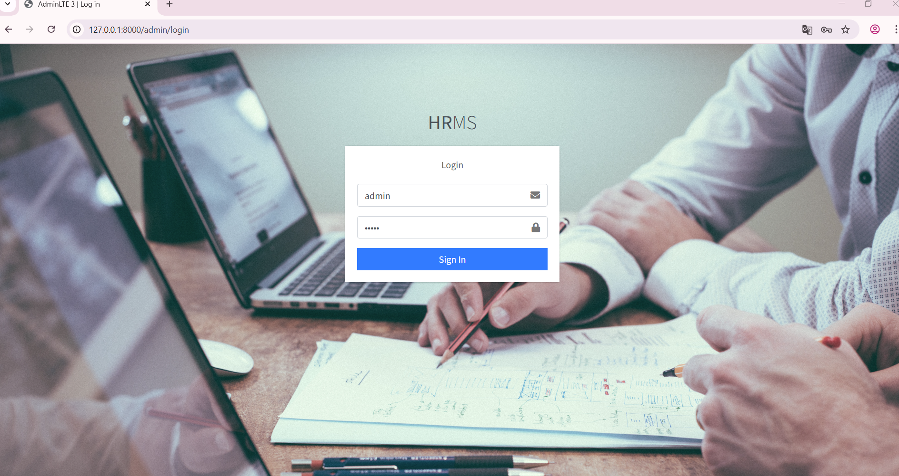


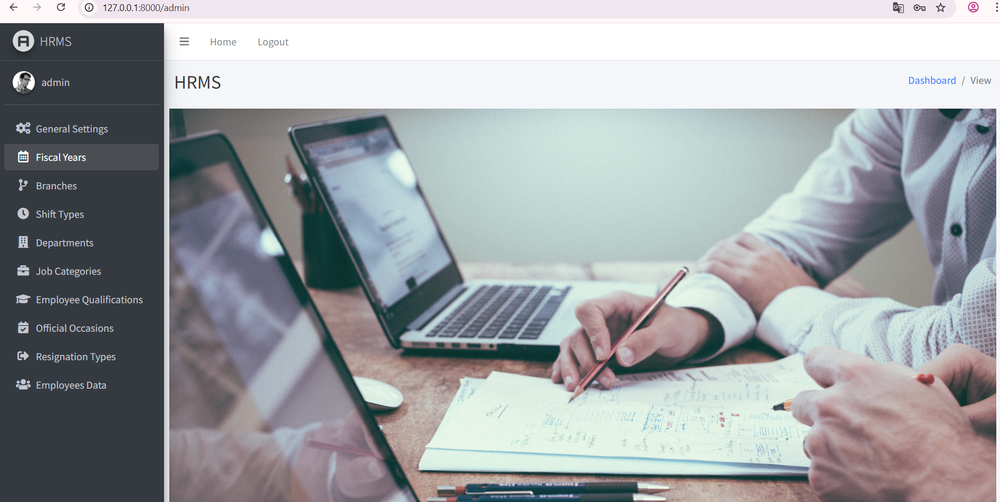


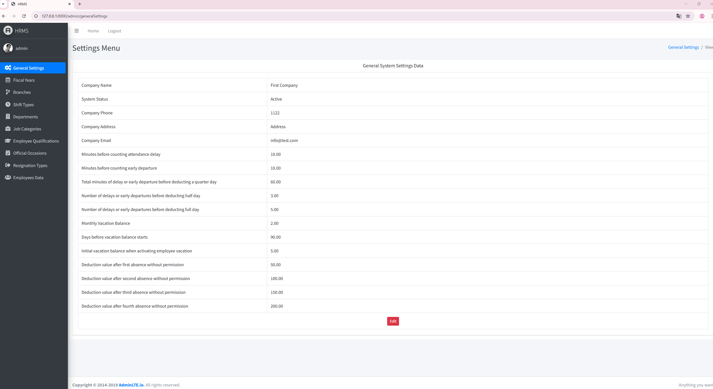


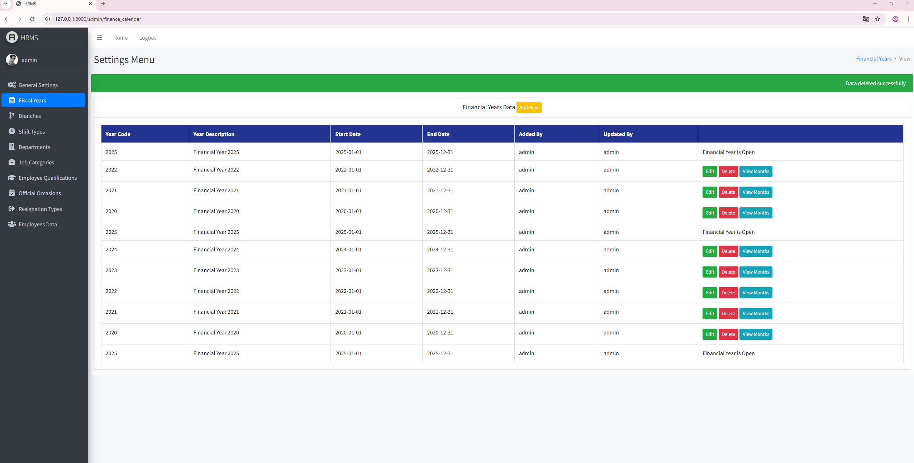


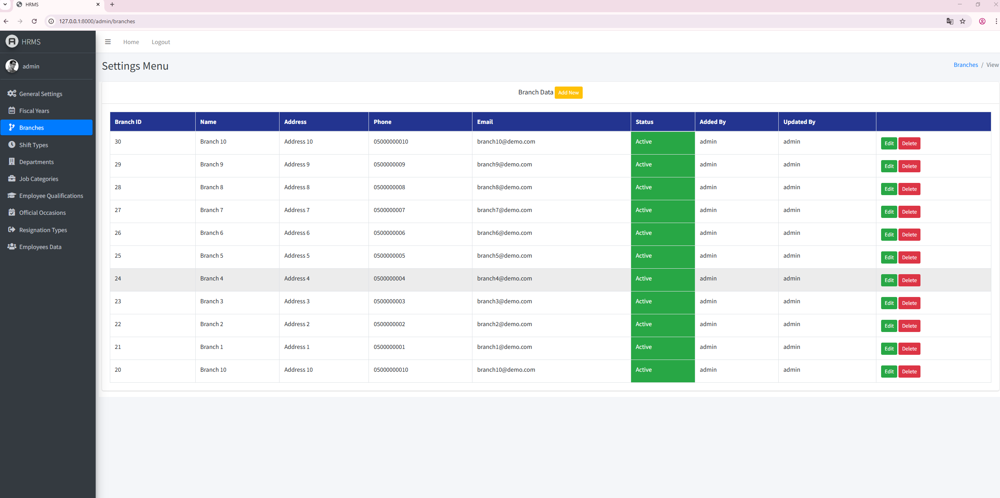


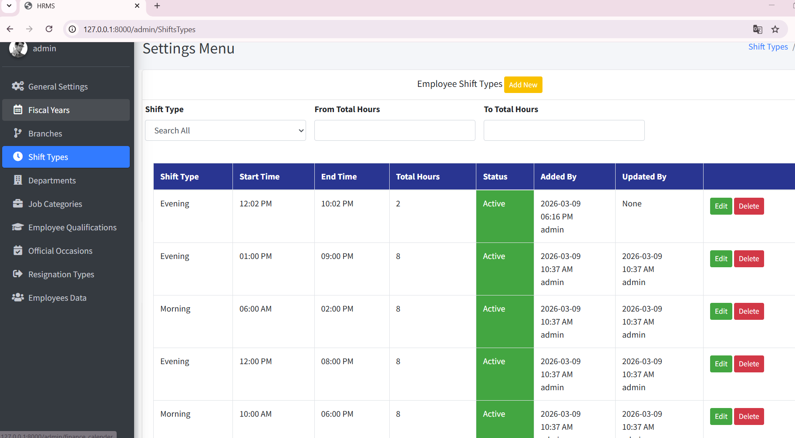


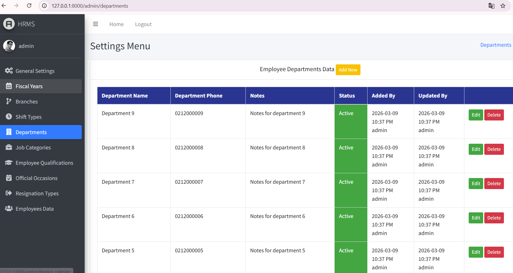


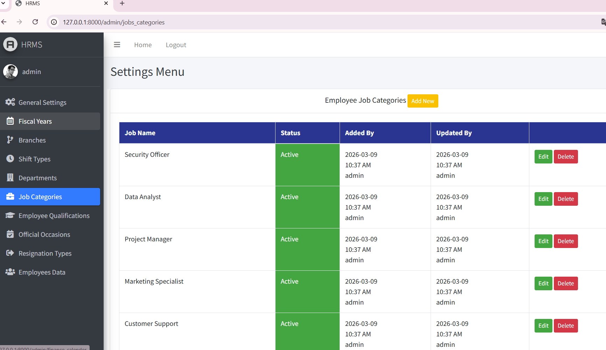


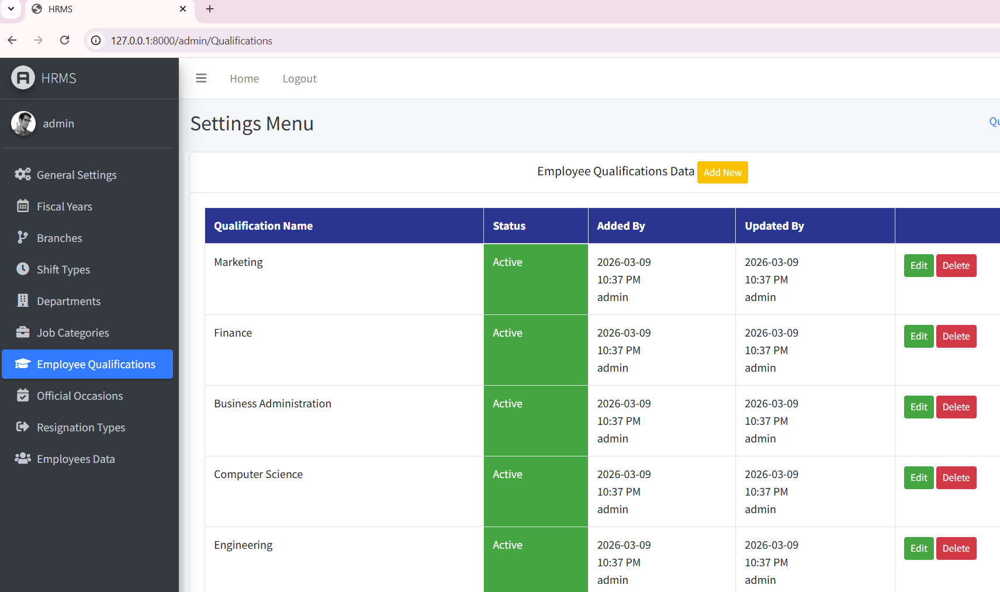


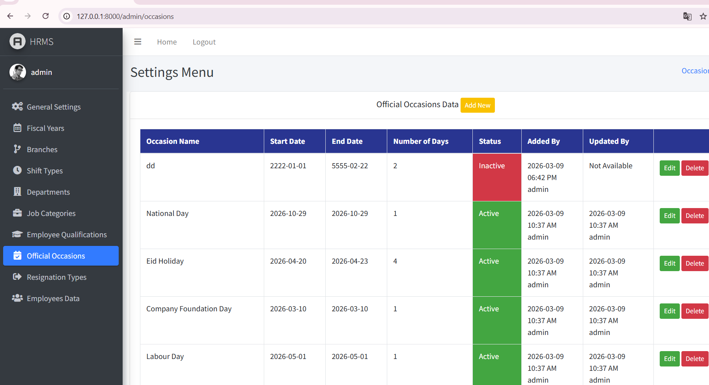


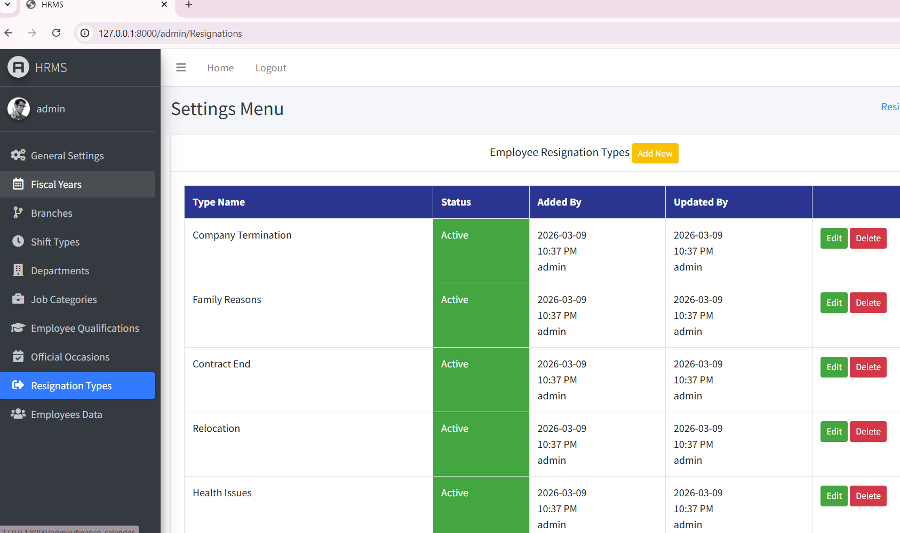


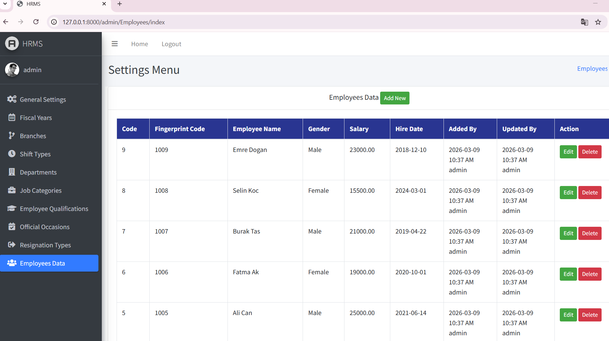


